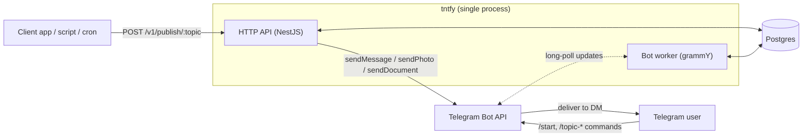
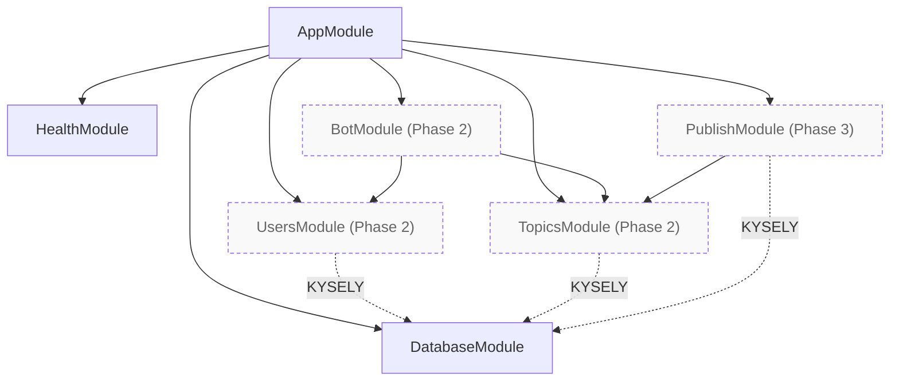
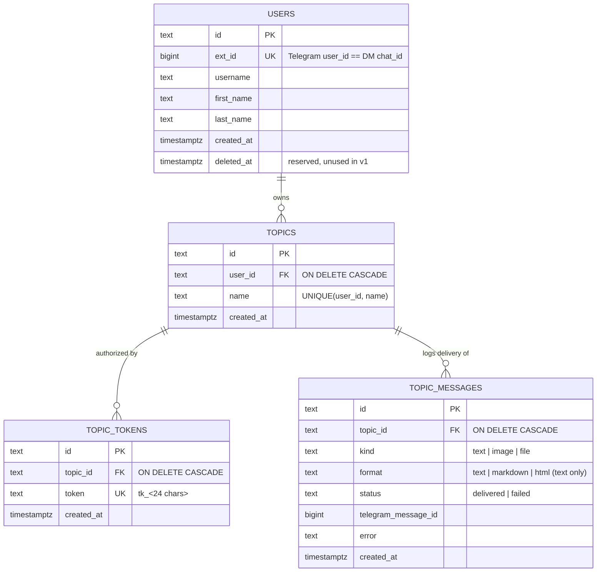
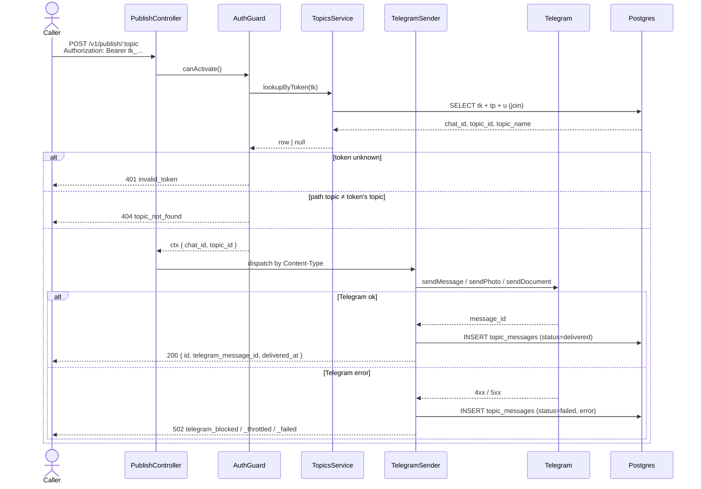

# tntfy — Architecture (v1)

Visual companion to [`prd.md`](prd.md). Diagrams are authored in Mermaid; column-level details live in the PRD's data-model section.

## System context

A single NestJS process exposes the HTTP API and runs the Telegram bot via long-polling. Postgres is the only stateful dependency.



## NestJS module graph

Solid arrows are `imports` edges (one module pulls another in). Dotted arrows are runtime `KYSELY` injection — `DatabaseModule` is `@Global()` so consumers inject without re-importing.

Boxes marked `(Phase 2)` and `(Phase 3)` are planned, not yet built.



### Module responsibilities

| Module | Owns | Notes |
|---|---|---|
| `DatabaseModule` | `KYSELY` provider, pool teardown on shutdown | Global; built |
| `HealthModule` | `GET /v1/health` | Built |
| `UsersModule` | `users` CRUD; `create_or_get` by `ext_id` | Phase 2 |
| `TopicsModule` | `topics` + `topic_tokens` (tightly coupled — rotation, cascade) | Phase 2 |
| `BotModule` | grammY bot, slash commands, `<tg-spoiler>` snippets | Phase 2 |
| `PublishModule` | `POST /v1/publish/:topic`, auth guard, content-type dispatcher, `TelegramSender`, `topic_messages` writes | Phase 3 |

## Entity-relationship diagram

Schema-level cardinalities. The full column list with types, defaults, and indexes lives in [`prd.md` §Data model](prd.md#data-model).



Application invariants on top of the schema (not enforced by constraints):

- One *active* token per topic at a time — `/rotate` hard-deletes the old row before inserting the new one. The schema allows N rows; the app keeps it at 1.
- Topic names match `^[a-z0-9][a-z0-9-_]{1,63}$` — validated in `TopicsService` before insert.

## Publish request flow

`POST /v1/publish/:topic` — single synchronous attempt, no server-side retry.



## Bot command flow — `/create`

Representative for the topic-management commands. Other commands (`/list`, `/rotate`, `/remove`) follow the same shape with different DB operations.

```mermaid
sequenceDiagram
    actor User as Telegram User
    participant TG as Telegram
    participant Bot as BotModule (grammY)
    participant Topics as TopicsService
    participant DB as Postgres

    User->>TG: /create deploys
    TG->>Bot: update (ext_id, args)
    Bot->>Topics: createTopic(ext_id, "deploys")
    Topics->>Topics: validate name regex
    Topics->>DB: INSERT topics + topic_tokens (txn)
    DB-->>Topics: topic_id, token
    Topics-->>Bot: { topic, token }
    Bot-->>TG: reply with curl + Python snippets,<br/>token wrapped in &lt;tg-spoiler&gt;
    TG-->>User: rendered message
```

## Cross-cutting concerns

- **Audit logging.** Every state-changing operation emits one structured JSON log line with `op`, `request_id`, `user_id`. See [`prd.md` §Audit logging](prd.md#audit-logging) for the table of `op` values. Bodies and tokens are never logged.
- **Shutdown.** `app.enableShutdownHooks()` in `main.ts` triggers `DatabaseModule.onModuleDestroy()`, which calls `Kysely.destroy()` to drain the pg pool.
- **Configuration.** Read directly from `process.env` in v1: `DATABASE_URL`, `TELEGRAM_BOT_TOKEN`, `PUBLIC_BASE_URL`, `PORT`. No `@nestjs/config` until a second consumer needs it.

## Phase status (2026-05-07)

| Phase | Scope | Status |
|---|---|---|
| 1 | Repo bootstrap, data layer, `/v1/health` | Done |
| 2 | Telegram bot (control plane) | Pending |
| 3 | Publish API | Pending |
| 4 | Polish (Swagger, audit logs, Dockerfile, README) | Pending |
